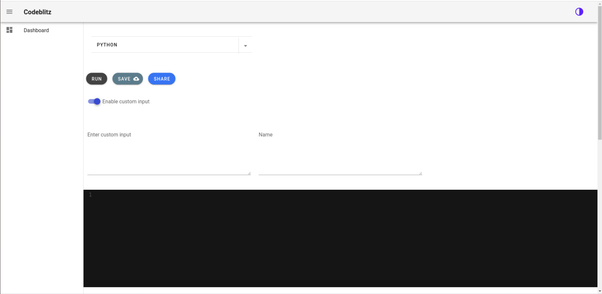
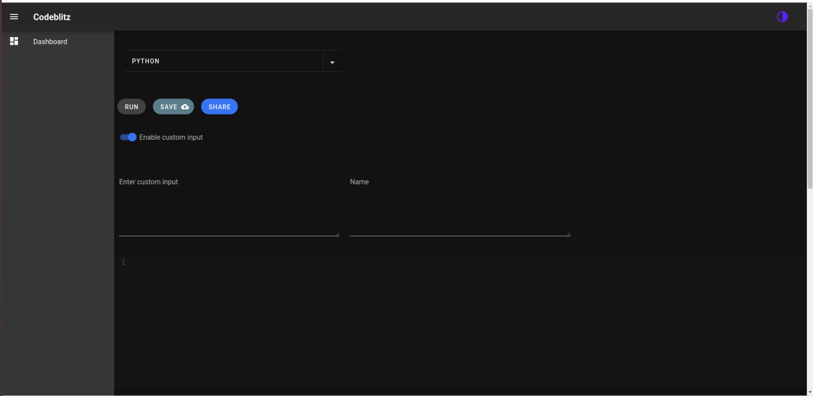
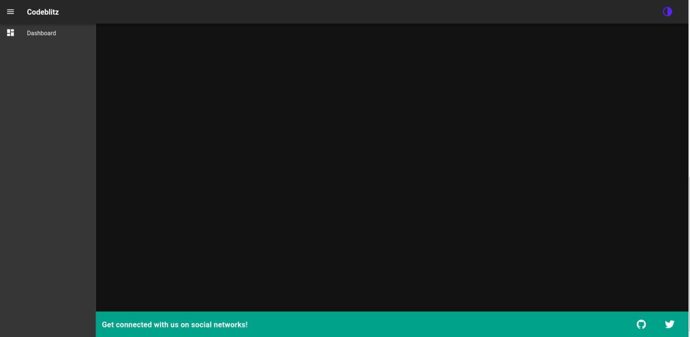

# codeblitz
A vue js based Multi-Language code editor which dynamically switches between the preferred language of choice .The application is highly scalable and reactive in nature.

Light mode 



Dark mode support



Footer links



## Project setup
```
npm install
```

### Compiles and hot-reloads for development
```
npm run serve
```

### Compiles and minifies for production
```
npm run build
```

### Lints and fixes files
```
npm run lint
```

### Customize configuration
See [Configuration Reference](https://cli.vuejs.org/config/).
